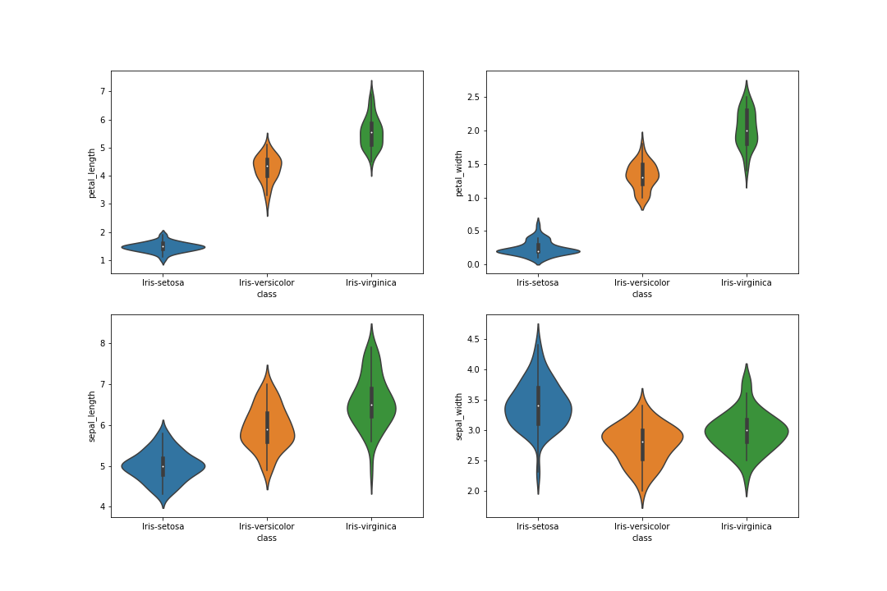
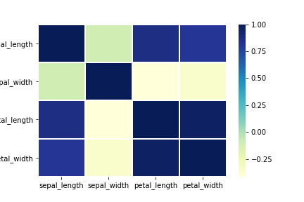

# Programing and Scripting Project

## Research
### Background information about the Iris Dataset
The data set consists of 149 samples from each of three species of Iris (Iris setosa, Iris virginica and Iris versicolor). 

The dataset contains five attributes - petal length, petal width, sepal length, sepal width and species. 

## Preparation

There were 5 key libraries installed. Below is a list of the Python  libraries required for this project:


- numpy
- matplotlib
- pandas
- seaborn


## Investigation
 
```python

print(df.shape)

```
prints out (149,5) 149 rows and 5 columns 

####  Peak at the Data

```python
print(df.head(20))
```
prints out the first twenty rows 


### Summary stattistics
```python
print(df.describe())
```

The describe() is used to view some basic statistical details like percentile, mean, std etc. of a data frame or a series of numeric values.


#### Class Distribution
Let’s now take a look at the number of instances (rows) that belong to each class. We can view this as an absolute count.
```python
print(df.groupby('class').size())
```


| Class           |  size  |
|-----------------|--------|
| Iris-setosa     |    49  |
| Iris-versicolor |    50  |
| Iris-virginica  |     50 |

dtype: int64

### Data Visualization

We now have a basic idea about the data. We need to extend that with some visualizations.

We are going to look at two types of plots:

Univariate plots to better understand each attribute.
Multivariate plots to better understand the relationships between attributes.


#### Box and whisker plots
Each horizontal line starting from bottom will show the minimum, lower quartile, median, upper quartile and maximum value of Sepal length, Sepal Width, Petal length and Petal Width of each species Iris setosa, Iris virginica and Iris versicolor. distribution of a continues variable across the categories


#### Scatterplots matrix
This dataset examines sepal length, sepal width, petal length, and petal width and then classifies the species.
Light blue indicates Iris setosa, pink Iris versicolor, and purple Iris virginica.
- Iris setosa has a large sepal width but small petal width.

- Iris virginica has a large sepal length and petal length.
- Iris versicolor sits between setosa and virginica much of the time.
```python
sns.pairplot(data=df,hue="class",palette="Set2")
```


#### Violin PLot

The above Violin Boxplot of Species shows that Iris Virginica has highest median value in petal length, petal width and sepal length when compared against Versicolor and Setosa. However, Iris Setosa has the highest sepal width median value. We can also see significant difference between Setosa’s sepal lenght and width against its petal length and width. That differene is smaller in Versicolor and Virginica. The violin plot also indicates that the weight of the Virginica sepal width and petal width are highly concentrated around the median




#### Correlation Matrix



## References 
1. Scikit-Learn , The Iris Dataset,https,<https://scikit-learn.org/stable/auto_examples/datasets/plot_iris_dataset.html>
2. Curran Kelleher,The Iris Dataset, https://gist.github.com/curran/a08a1080b88344b0c8a7
3. geeksforgeeks,Python | Pandas Dataframe.describe() method ,<https://www.geeksforgeeks.org/python-pandas-dataframe-describe-method/>
4. datascience+,Use Box Plots to Assess the Distribution and to Identify the Outliers in Your Dataset,<https://datascienceplus.com/box-plots-identify-outliers/>
5. What is a SPLOM chart? Making scatterplot matrices in Python, <https://medium.com/@plotlygraphs/what-is-a-splom-chart-make-scatterplot-matrices-in-python-8dc4998921c3>
6. Iris Dataset EDA and Classification Analysis,
<https://www.kaggle.com/lnbalon/iris-dataset-eda-and-classification-analysis>
7. Famous Iris data set exploration, <http://rstudio-pubs-static.s3.amazonaws.com/321676_20be34434fe44ed2b229eadeabe0eb98.html>
