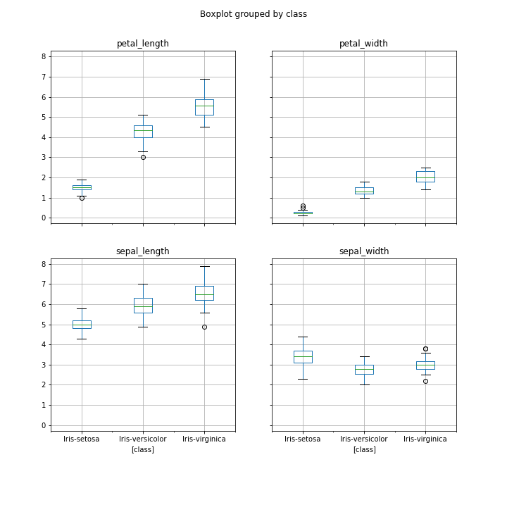

# Programing and Scripting Project

## Research
### Background information about the Iris Dataset
The data set consists of 149 samples from each of three species of Iris (Iris setosa, Iris virginica and Iris versicolor). 

The dataset contains five attributes - petal length, petal width, sepal length, sepal width and species.

## Preparation

There were 5 key libraries installed. Below is a list of the Python SciPy libraries required for this project:

- scipy
- numpy
- matplotlib
- pandas
- sklearn 


## Investigation
 
```python

print(df.shape)

```
prints out (149,5) 149 rows and 5 columns 

####  Peak at the Data

```python
print(df.head(20))
```
prints out the first twenty rows 


### Summary stattistics
```python
print(df.describe())
```

The describe() is used to view some basic statistical details like percentile, mean, std etc. of a data frame or a series of numeric values.


#### Class Distribution
Let’s now take a look at the number of instances (rows) that belong to each class. We can view this as an absolute count.


### Data Visualization

We now have a basic idea about the data. We need to extend that with some visualizations.

We are going to look at two types of plots:

Univariate plots to better understand each attribute.
Multivariate plots to better understand the relationships between attributes.

#### Univariate Plots
We start with some univariate plots, that is, plots of each individual variable.

Given that the input variables are numeric, we can create box and whisker plots of each


##### Box and whisker plots





##### histrogram
A histogram of each input variable to get an idea of the distribution.


####  Multivariate Plots

##### Scatterplots matrix


## Summary of  Investigations.
 Include supporting tables and graphics as you deem necessary.


### Evaluate  Algorithms


Split dataset into random train and test subsets
```python
array = df.values
X = array[:,0:4]
Y = array[:,4]
validation_size = 0.20
seed = 7
scoring = 'accuracy'
X_train, X_validation, Y_train, Y_validation = model_selection.train_test_split(X, Y, test_size=validation_size, random_state=seed)
```

### Make Predictions
The KNN algorithm is very simple and was an accurate model based on the tests. Now we want to get an idea of the accuracy of the model on our validation set.

This will give us an independent final check on the accuracy of the best model. It is valuable to keep a validation set just in case you made a slip during training, such as overfitting to the training set or a data leak. Both will result in an overly optimistic result.

We can run the KNN model directly on the validation set and summarize the results as a final accuracy score, a confusion matrix and a classification report

## References 
1. Scikit-Learn , The Iris Dataset,https,<https://scikit-learn.org/stable/auto_examples/datasets/plot_iris_dataset.html>
2. Curran Kelleher,The Iris Dataset, https://gist.github.com/curran/a08a1080b88344b0c8a7
3. Jason Brownlee on June 10, 2016 in Python Machine Learning,Your First Machine Learning Project in Python Step-By-Step, <https://machinelearningmastery.com/machine-learning-in-python-step-by-step/>
4. Scikit-learn Classifiers on Iris Dataset <https://www.kaggle.com/chungyehwang/scikit-learn-classifiers-on-iris-dataset>
5. Ritchie Ng,Evaluating a Classification Model <https://www.ritchieng.com/machine-learning-evaluate-classification-model/>
6. geeksforgeeks,Python | Pandas Dataframe.describe() method ,<https://www.geeksforgeeks.org/python-pandas-dataframe-describe-method/>
